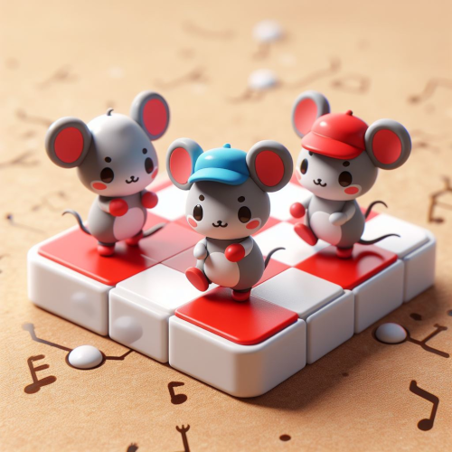

# Music generators
- [bpm, rhythm, melody generators](https://y-bears.github.io/music-quokka/bpm-rhythm-melody.html)
- [drums generator](https://y-bears.github.io/music-quokka/drums.html)
- [scale and chords generators](https://y-bears.github.io/music-quokka/scale-chords.html)
- [chords in scales](https://y-bears.github.io/music-quokka/ch-in-scale.html)
- [arpeggio generator](https://y-bears.github.io/music-quokka/arp.html)
- [rhythm generator (graphic)](https://y-bears.github.io/music-quokka/rhythm-boxes.html)
- [chord type](https://y-bears.github.io/music-quokka/chorder.html)
- [notes](https://y-bears.github.io/music-quokka/random-note.html)

3.12.2024 1518

This project is maintained by [y-bears](https://github.com/y-bears)
